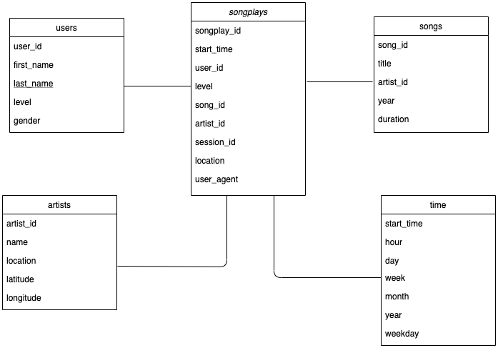
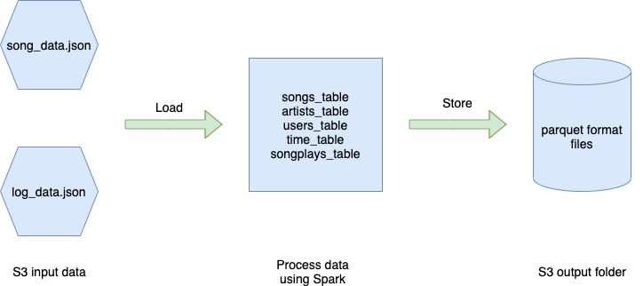

### Purpose

This project is to build an ETL pipline that extracts Sparkify data from S3, processes them using Spark and loads the data back into S3 as a set of dimensional tables. This will enable Sparkify's analysts to do new types of analytics on large scale and various sources of data to continue finding insights in what songs their users are listening to. 

### Data Schema - Star Schema

The schema includes the following tables:

**Fact Table**
1. songplays - records in log data associated with song plays i.e. records with page NextSong
    - songplay_id, start_time, user_id, level, song_id, artist_id, session_id, location, user_agent

**Dimension Tables** 

2. users - users in the app
    - user_id, first_name, last_name, gender, level
    
3. songs - songs in music database
    - song_id, title, artist_id, year, duration
    
4. artists - artists in music database
    - artist_id, name, location, latitude, longitude

5. time - timestamps of records in songplays broken down into specific units
    - start_time, hour, day, week, month, year, weekday
   

### ETL Piplines

### Project Guideline

The project repository includes three files:

1. README.md project overview

2. etl.py reads data from S3, processes data using Spark and write them back to S3

3. dl.cfg individual AWS credentials to work with EMR and S3

***How to use***

     Step 1: read file README.md to get an overview about the project.
     
     Step 2: create an EMR cluster which had Spark, Livy and Hadoop installed
     
     Step 3: fill in dl.cfg with your AWS credentials
     
     Step 4: run file etl.py on EMR CLI 